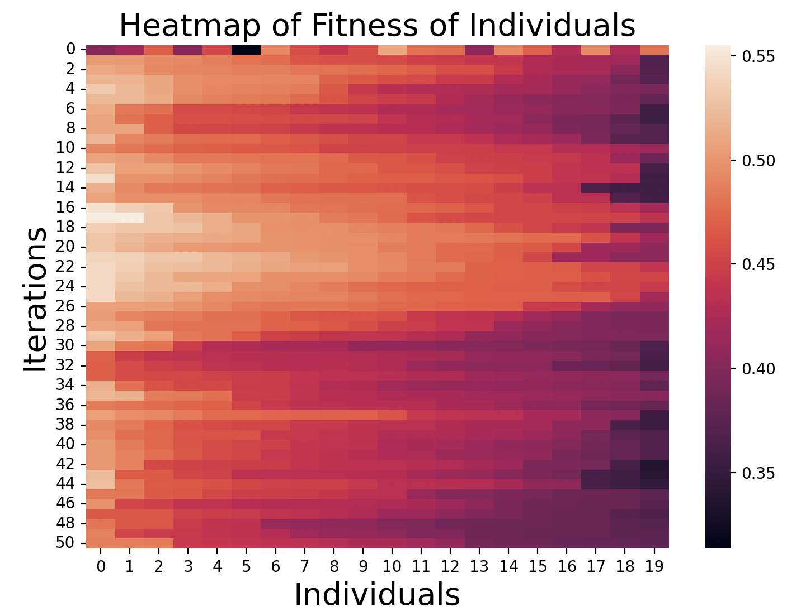
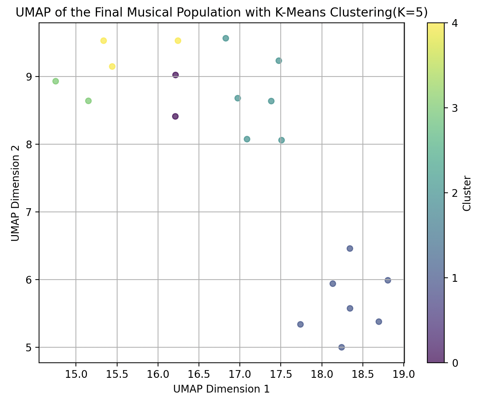
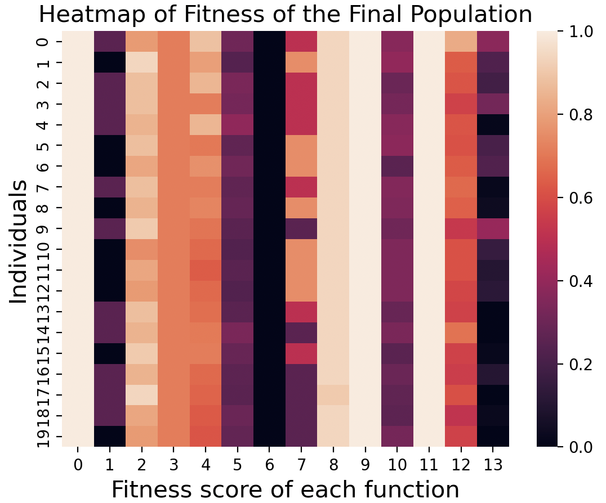

# Genetic-Algorithm-Based Stochasitic Composition

  

## Introduction 👋

  

**Genetic Algorithm (GA)** is applied in machine composition by simulating the process of **natural selection and biological evolution** to automatically generate works that conform to specific musical rules. It encodes music segments as individuals, evaluates their quality using a **fitness function**, and performs evolution through selection, crossover, and mutation operations. After several generations of iteration, the algorithm generates harmonious and creative melodies, harmonies, and rhythms that meet various style and emotional requirements. The global search capability and flexibility of genetic algorithms make them powerful tools in music composition, widely used in melody generation, harmony creation, and rhythm design.

  

## Usage 🖥️

**Clone the repository:**

``` bash

git  clone  git@github.com:lhtPeking/Machine-based-Composition.git

```

**Requirements:**
If you are using **conda** to manage your environment, please execute the following command:

``` bash

conda  env  create  -f  environment.yml

```
Else if you are using **pip** to manage your environment, just run ```pip install ***``` whenever you meet a ```ModuleNotFoundError: No module named '***'```

**Switch to the directory where our model is located:**

``` bash

cd  Model

```

**The format for entering commands:**

```python main.py [populationSize] [individualLength] [Flag_M：Do mutation or not.(1 for yes, 0 for no)] [Flag_T：Do transposition or not.(1 for yes, 0 for no)] [Flag_I：Do inversion or not.(1 for yes, 0 for no)] [Flag_R：Do retrograde or not.(1 for yes, 0 for no)] [Flag_C：Do crossover or not.(1 for yes, 0 for no)] [mutationRatio] [crossoverRatio] [transpositionRatio] [inversionRatio] [retrogradeRatio] [maxIter] [fitness_Iter] [fitness_Final] [fitnessWeights_NormalStart] [fitnessWeights_BarEnd] [fitnessWeights_AvoidUnpreferredPitch] [fitnessWeights_AvoidSyncopation] [fitnessWeights_AvoidBigInterval] [fitnessWeights_GoodInterval] [fitnessWeights_AvoidBigFluctuation] [fitnessWeights_AvoidContinueUpOrDown] [fitnessWeights_AvoidNoteRepetition] [fitnessWeights_AvoidNoChange] [fitnessWeights_LocalChange] [fitnessWeights_AvoidBigDurationChange] [fitnessWeights_KeepInAnOctave] [fitnessWeights_SimilarityBetweenBars] [fileName]```

  

Example:```(GAmusic) haotianli@bogon Model % python main.py 20 32 1 1 1 1 1 0.1 0.1 0.1 0.1 0.1 50 0.8 1.2 0.1 0.1 0.1 0.1 0.1 0.1 0.1 0.1 0.1 0.1 0.1 0.1 0.1 0.1 output1```

  

  

## Methods ✍️

  

### 1 Generation of Initial Population

  

We use a random simulation approach to generate 27 pitch sequences (from $F_3$ to $G_5$ in the musical scale). We use digital encoding (0 as a rest, 1-27 as notes, and 28 as a sustain note). The specific generation function is located in the ```random_initial_population(self)``` function in ```GAmusic.py```.

  

### 2 Transformations in Each Iteration

  

We define five transformation methods: ```mutation()```, ```transposition()```, ```inversion()```, ```retrograde()```, and ```crossover()``` (see the corresponding functions in ```GAmusic.py```). A flag parameter is used to decide whether to apply these transformations during the iteration process.

  

### 3 Natural Selection and Fitness Function

  

We calculate the fitness of each individual according to the defined fitness function and select individuals from the population using a **probability-weighted** method based on their fitness, to avoid getting stuck in local minima. The iteration stops when either the predefined maximum number of iterations is reached or when an individual’s fitness reaches a threshold.

  

The overall fitness function is a weighted sum of 14 functions, each evaluating one aspect of an individual:

  

**No1.**  ```Fitness_NormalStart``` penalizes beginning with a rest or a sustain note.

  

**No2.**  ```Fitness_BarEnd``` rewards rests and sustain notes at the end of each bar to make boundaries clear.

  

**No3.**  ```Fitness_AvoidUnpreferredPitch``` penalizes appearance of unpreferred notes, while what notes are not unpreferred needs manual design.

  

**No4.**  ```Fitness_AvoidSyncopation``` penalizes rests and sustain notes appearing at the start of the 1st or 3rd beat in a bar (downbeats in 4/4).

  

**No.5**  ```Fitness_AvoidBigInterval``` penalizes intervals bigger than an octave to avoid too sharp pitch change.

  

**No.6**  ```Fitness_GoodInterval``` rewarding consonant intervals like perfect fifth to promote pleasant melodies.

  

**No.7**  ```Fitness_AvoidBigFluctuation``` penalizes big variance in all intervals to improve smoothness.

  

**No.8**  ```Fitness_AvoidContinueUpOrDown``` penalizes continuous same-direction pitch changes in each bar, realized by limiting the interval between first and last notes in a bar.

  

**No.9**  ```Fitness_AvoidNoteRepetition``` penalizes staying at a same pitch whether by sustaining a note or by using new notes of the same pitch.

  

**No.10**  ```Fitness_AvoidNoChange``` penalizes repeated notes with same pitch and duration.

  

**No.11**  ```Fitness_LocalChange``` promotes corresponding local changes by rewarding 3 ascending or descending neighbor notes.

  

**No.12**  ```Fitness_AvoidBigDurationChange``` penalizes bigger duration changes between neighbor notes than 3, promoting relatively smooth transition.

  

**No.13**  ```Fitness_KeepInAnOctave``` promotes more notes to be placed within an octave by rewarding the max number of notes in an octave.

  

**No.14**  ```Fitness_SimilarityBetweenBars``` promotes the similarity between bars by rewarding the proximity of means and vars of their intervals.

  

Each fitness function outputs a number in **[0,1]**, so their weights can be equally considered.

  

### 4 From Digital Encoding to Musical Notation

  We utilized Python's ```MIDO``` library to achieve the conversion from numerical encoding to pitch encoding. The specific implementation details can be found in ```Model/utils/Mapping.py```, where ```quarter_note_ticks=480``` and the tempo is set to ```120 BPM```. The generated audio files are located in the ```Results``` folder.

### 5 Visualization

  

We use **Heatmaps** to represent the fitness values of the population throughout the iteration process, providing an intuitive analysis of how different **hyperparameter selections** affect the iteration.

</b>



Additionally, we apply **UMAP** dimensionality reduction to represent each individual as a vector defined by 14 fitness function values and perform clustering analysis.

</b>



</b>

And also its companion heatmap, which provides additional insights into the **characteristics** of a piece of music:

</b>

</b>

## Results 📋
We conducted numerous experiments and detailed analyses on the various hyperparameters selected for the entire model. Our focus was on studying the impact of the choice of the fitness function on genetic iterations. The specific research report can be found in the ```Reports``` folder.
  

  

## References 📜
**[1]** Dragan Matić. "A Genetic Algorithm for Composing Music." The Yugoslav Journal of Operations Research 20.39 (2010): 157-177.

**[2]** Shipra Shukla & Haider Banka. "Monophonic music composition using genetic algorithm and Bresenham's line algorithm." Multimedia Tools and Applications 81.18 (2022): 26483–26503.

**[3]** Huang Chengyu et al. "Algorithm Composition By Genetic Algorithm." Microcomputer Applications 30.3 (2014): 1-4.

**[4]** Du Peng et al. "An Auto Composing Method for Motive of Inventions Based on Genetic Algorithm." Computer Technology and Development 17.4 (2007): 150-153.
